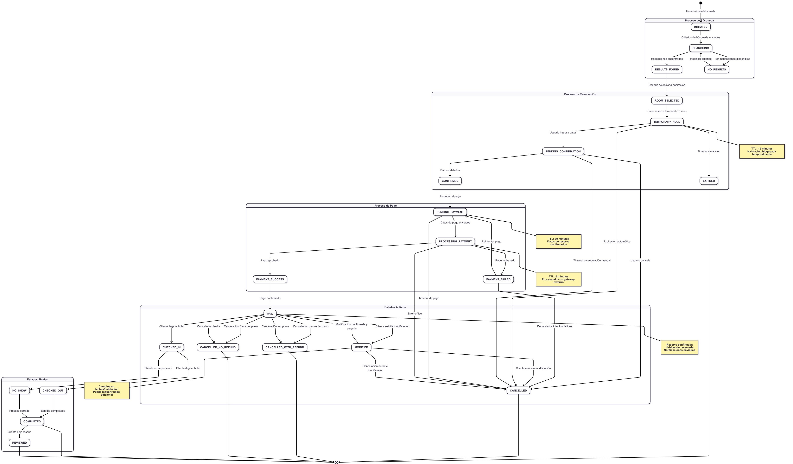

# Posible Solución
## Diagrama de Flujo
El diagrama de arquitectura:

```
graph TB
    subgraph "Frontend Layer"
        WA[Web Application]
        MA[Mobile Application]
        AA[Admin Panel]
    end

    subgraph "API Gateway Layer"
        AG[API Gateway]
        LB[Load Balancer]
    end

    subgraph "Microservices Layer"
        US[User Service]
        AS[Auth Service]
        SS[Search Service]
        RS[Reservation Service]
        IS[Inventory Service]
        PS[Payment Service]
        NS[Notification Service]
        HMS[Hotel Management Service]
        RS_REP[Review Service]
    end

    subgraph "Data Layer"
        UDB[(User Database)]
        RDB[(Reservation Database)]
        IDB[(Inventory Database)]
        PDB[(Payment Database)]
        HDB[(Hotel Database)]
        REVDB[(Review Database)]
        CACHE[(Redis Cache)]
    end

    subgraph "External Services"
        PG[Payment Gateway - Stripe/PayPal]
        EMAIL[Email Service - SendGrid]
        SMS[SMS Service - Twilio]
        MAPS[Maps API - Google Maps]
    end

    subgraph "Message Queue"
        MQ[Message Queue - RabbitMQ/Kafka]
    end

    subgraph "Monitoring & Logging"
        LOG[Logging Service]
        MON[Monitoring - Prometheus]
        TRACE[Distributed Tracing - Jaeger]
    end

    %% Frontend to API Gateway
    WA --> AG
    MA --> AG
    AA --> AG

    %% API Gateway to Load Balancer
    AG --> LB

    %% Load Balancer to Services
    LB --> US
    LB --> AS
    LB --> SS
    LB --> RS
    LB --> IS
    LB --> PS
    LB --> NS
    LB --> HMS
    LB --> RS_REP

    %% Service to Database connections
    US --> UDB
    RS --> RDB
    IS --> IDB
    PS --> PDB
    HMS --> HDB
    RS_REP --> REVDB

    %% Cache connections
    SS --> CACHE
    IS --> CACHE
    US --> CACHE

    %% External service connections
    PS --> PG
    NS --> EMAIL
    NS --> SMS
    SS --> MAPS
    HMS --> MAPS

    %% Message Queue connections
    RS --> MQ
    PS --> MQ
    NS --> MQ
    IS --> MQ

    %% Inter-service communication
    RS -.-> IS
    RS -.-> PS
    RS -.-> NS
    SS -.-> IS
    AS -.-> US

    %% Monitoring connections
    US --> LOG
    RS --> LOG
    IS --> LOG
    PS --> LOG
    NS --> LOG
    HMS --> LOG
    SS --> LOG
    AS --> LOG
    RS_REP --> LOG

    LB --> MON
    AG --> TRACE
```

Esto se vería de la siguiente manera:

## UML
El diagrama UML :

```
graph TD
    subgraph "Presentation Layer"
        WebApp[<<component>><br/>Web Application<br/>React/Angular]
        MobileApp[<<component>><br/>Mobile Application<br/>React Native/Flutter]
        AdminPanel[<<component>><br/>Admin Panel<br/>React/Vue]
    end

    subgraph "API Gateway"
        Gateway[<<component>><br/>API Gateway<br/>Kong/Nginx]
        AuthMiddleware[<<component>><br/>Authentication<br/>Middleware]
        RateLimit[<<component>><br/>Rate Limiting<br/>Middleware]
    end

    subgraph "Core Services"
        UserMgmt[<<component>><br/>User Management<br/>Service]
        AuthService[<<component>><br/>Authentication<br/>Service]
        SearchEngine[<<component>><br/>Search Engine<br/>Service]
        ReservationMgmt[<<component>><br/>Reservation<br/>Management]
        InventoryMgmt[<<component>><br/>Inventory<br/>Management]
        PaymentProc[<<component>><br/>Payment<br/>Processing]
        NotificationSvc[<<component>><br/>Notification<br/>Service]
        HotelMgmt[<<component>><br/>Hotel Management<br/>Service]
        ReviewSvc[<<component>><br/>Review & Rating<br/>Service]
    end

    subgraph "Data Access Layer"
        UserRepo[<<component>><br/>User Repository<br/>ORM/DAO]
        ReservationRepo[<<component>><br/>Reservation Repository<br/>ORM/DAO]
        InventoryRepo[<<component>><br/>Inventory Repository<br/>ORM/DAO]
        PaymentRepo[<<component>><br/>Payment Repository<br/>ORM/DAO]
        HotelRepo[<<component>><br/>Hotel Repository<br/>ORM/DAO]
        ReviewRepo[<<component>><br/>Review Repository<br/>ORM/DAO]
    end

    subgraph "Data Storage"
        UserDB[<<database>><br/>User Database<br/>PostgreSQL]
        ReservationDB[<<database>><br/>Reservation Database<br/>PostgreSQL]
        InventoryDB[<<database>><br/>Inventory Database<br/>MongoDB]
        PaymentDB[<<database>><br/>Payment Database<br/>PostgreSQL]
        HotelDB[<<database>><br/>Hotel Database<br/>PostgreSQL]
        ReviewDB[<<database>><br/>Review Database<br/>MongoDB]
        CacheDB[<<database>><br/>Cache Database<br/>Redis]
    end

    subgraph "External Integrations"
        PaymentGW[<<component>><br/>Payment Gateway<br/>Stripe/PayPal API]
        EmailSvc[<<component>><br/>Email Service<br/>SendGrid API]
        SMSSvc[<<component>><br/>SMS Service<br/>Twilio API]
        MapsSvc[<<component>><br/>Maps Service<br/>Google Maps API]
    end

    subgraph "Infrastructure"
        MessageQueue[<<component>><br/>Message Queue<br/>RabbitMQ/Kafka]
        Logger[<<component>><br/>Logging Service<br/>ELK Stack]
        Monitor[<<component>><br/>Monitoring<br/>Prometheus/Grafana]
    end

    %% Presentation to Gateway
    WebApp -->|HTTPS/REST| Gateway
    MobileApp -->|HTTPS/REST| Gateway
    AdminPanel -->|HTTPS/REST| Gateway

    %% Gateway components
    Gateway --> AuthMiddleware
    Gateway --> RateLimit

    %% Gateway to Services
    Gateway -->|gRPC/HTTP| UserMgmt
    Gateway -->|gRPC/HTTP| AuthService
    Gateway -->|gRPC/HTTP| SearchEngine
    Gateway -->|gRPC/HTTP| ReservationMgmt
    Gateway -->|gRPC/HTTP| InventoryMgmt
    Gateway -->|gRPC/HTTP| PaymentProc
    Gateway -->|gRPC/HTTP| NotificationSvc
    Gateway -->|gRPC/HTTP| HotelMgmt
    Gateway -->|gRPC/HTTP| ReviewSvc

    %% Services to Repositories
    UserMgmt --> UserRepo
    ReservationMgmt --> ReservationRepo
    InventoryMgmt --> InventoryRepo
    PaymentProc --> PaymentRepo
    HotelMgmt --> HotelRepo
    ReviewSvc --> ReviewRepo

    %% Repositories to Databases
    UserRepo --> UserDB
    ReservationRepo --> ReservationDB
    InventoryRepo --> InventoryDB
    PaymentRepo --> PaymentDB
    HotelRepo --> HotelDB
    ReviewRepo --> ReviewDB

    %% Cache connections
    SearchEngine --> CacheDB
    InventoryMgmt --> CacheDB
    UserMgmt --> CacheDB

    %% External integrations
    PaymentProc -->|REST API| PaymentGW
    NotificationSvc -->|REST API| EmailSvc
    NotificationSvc -->|REST API| SMSSvc
    SearchEngine -->|REST API| MapsSvc
    HotelMgmt -->|REST API| MapsSvc

    %% Message Queue connections
    ReservationMgmt -->|Publish/Subscribe| MessageQueue
    PaymentProc -->|Publish/Subscribe| MessageQueue
    NotificationSvc -->|Publish/Subscribe| MessageQueue
    InventoryMgmt -->|Publish/Subscribe| MessageQueue

    %% Infrastructure connections
    UserMgmt --> Logger
    ReservationMgmt --> Logger
    InventoryMgmt --> Logger
    PaymentProc --> Logger
    NotificationSvc --> Logger
    SearchEngine --> Logger
    HotelMgmt --> Logger
    ReviewSvc --> Logger

    Gateway --> Monitor
    MessageQueue --> Monitor
```
El resultado visual seria este:


## Diagrama de secuencia
El diagrama de secuencia .

```
sequenceDiagram
    participant User as Usuario
    participant WebApp as Aplicación Web
    participant Gateway as API Gateway
    participant Auth as Auth Service
    participant Search as Search Service
    participant Inventory as Inventory Service
    participant Reservation as Reservation Service
    participant Payment as Payment Service
    participant Notification as Notification Service
    participant Cache as Redis Cache
    participant Queue as Message Queue
    participant ExtPay as Payment Gateway

    Note over User, ExtPay: Proceso de Reservación de Habitación

    %% 1. Búsqueda de habitaciones
    User->>WebApp: Buscar habitaciones (ubicación, fechas, huéspedes)
    WebApp->>Gateway: GET /api/search/rooms
    Gateway->>Auth: Validar token (opcional)
    Auth-->>Gateway: Token válido
    Gateway->>Search: searchRooms(criteria)
    
    Search->>Cache: Verificar cache de búsqueda
    alt Cache hit
        Cache-->>Search: Resultados en cache
    else Cache miss
        Search->>Inventory: getAvailableRooms(criteria)
        Inventory-->>Search: Lista de habitaciones disponibles
        Search->>Cache: Guardar resultados en cache
    end
    
    Search-->>Gateway: Resultados de búsqueda
    Gateway-->>WebApp: Lista de habitaciones
    WebApp-->>User: Mostrar habitaciones disponibles

    %% 2. Selección y inicio de reserva
    User->>WebApp: Seleccionar habitación
    WebApp->>Gateway: POST /api/reservations/initiate
    Gateway->>Auth: Validar autenticación
    Auth-->>Gateway: Usuario autenticado
    
    Gateway->>Reservation: initiateReservation(roomId, userId, dates)
    Reservation->>Inventory: checkAvailability(roomId, dates)
    Inventory-->>Reservation: Habitación disponible
    
    Reservation->>Reservation: Crear reserva temporal (15 min TTL)
    Reservation-->>Gateway: Reserva temporal creada
    Gateway-->>WebApp: ID de reserva temporal
    WebApp-->>User: Formulario de confirmación

    %% 3. Confirmación de datos
    User->>WebApp: Confirmar datos de reserva
    WebApp->>Gateway: POST /api/reservations/confirm
    Gateway->>Reservation: confirmReservation(reservationId, guestData)
    
    Reservation->>Inventory: lockRoom(roomId, dates)
    Inventory-->>Reservation: Habitación bloqueada
    
    Reservation->>Reservation: Actualizar estado a "PENDING_PAYMENT"
    Reservation-->>Gateway: Reserva confirmada, pendiente pago
    Gateway-->>WebApp: Datos de pago requeridos
    WebApp-->>User: Formulario de pago

    %% 4. Procesamiento de pago
    User->>WebApp: Introducir datos de pago
    WebApp->>Gateway: POST /api/payments/process
    Gateway->>Payment: processPayment(reservationId, paymentData)
    
    Payment->>ExtPay: Procesar pago con gateway externo
    ExtPay-->>Payment: Pago exitoso / Pago fallido
    
    alt Pago exitoso
        Payment->>Queue: Publicar evento PAYMENT_SUCCESS
        Payment-->>Gateway: Pago confirmado
        
        %% Procesar evento de pago exitoso
        Queue->>Reservation: Evento PAYMENT_SUCCESS
        Reservation->>Reservation: Actualizar estado a "CONFIRMED"
        Reservation->>Queue: Publicar evento RESERVATION_CONFIRMED
        
        Queue->>Inventory: Evento RESERVATION_CONFIRMED
        Inventory->>Inventory: Confirmar reserva en inventario
        Inventory->>Cache: Invalidar cache de disponibilidad
        
        Queue->>Notification: Evento RESERVATION_CONFIRMED
        Notification->>Notification: Preparar confirmación
        Notification-->>User: Email/SMS de confirmación
        
        Gateway-->>WebApp: Pago exitoso
        WebApp-->>User: Reserva confirmada exitosamente
        
    else Pago fallido
        Payment->>Queue: Publicar evento PAYMENT_FAILED
        Payment-->>Gateway: Error en pago
        
        Queue->>Reservation: Evento PAYMENT_FAILED
        Reservation->>Reservation: Actualizar estado a "CANCELLED"
        Reservation->>Inventory: unlockRoom(roomId, dates)
        Inventory->>Cache: Invalidar cache de disponibilidad
        
        Gateway-->>WebApp: Error en pago
        WebApp-->>User: Error - intentar nuevamente
    end

    %% 5. Notificaciones adicionales
    Note over Notification: Envío de notificaciones asíncronas
    Notification->>User: Email con detalles de reserva
    Notification->>User: SMS con código de confirmación

    Note over User, ExtPay: Reservación completada exitosamente

```
Se vería de esta manera:


## Diagrama de Estados

El diagrama de transición de estados:

```
stateDiagram-v2
    [*] --> INITIATED : Usuario inicia búsqueda

    state "Proceso de Búsqueda" as SearchProcess {
        INITIATED --> SEARCHING : Criterios de búsqueda enviados
        SEARCHING --> RESULTS_FOUND : Habitaciones encontradas
        SEARCHING --> NO_RESULTS : Sin habitaciones disponibles
        NO_RESULTS --> SEARCHING : Modificar criterios
        RESULTS_FOUND --> ROOM_SELECTED : Usuario selecciona habitación
    }

    state "Proceso de Reservación" as ReservationProcess {
        ROOM_SELECTED --> TEMPORARY_HOLD : Crear reserva temporal (15 min)
        TEMPORARY_HOLD --> EXPIRED : Timeout sin acción
        TEMPORARY_HOLD --> PENDING_CONFIRMATION : Usuario ingresa datos
        PENDING_CONFIRMATION --> CONFIRMED : Datos validados
        PENDING_CONFIRMATION --> CANCELLED : Usuario cancela
        CONFIRMED --> PENDING_PAYMENT : Proceder al pago
    }

    state "Proceso de Pago" as PaymentProcess {
        PENDING_PAYMENT --> PROCESSING_PAYMENT : Datos de pago enviados
        PROCESSING_PAYMENT --> PAYMENT_SUCCESS : Pago aprobado
        PROCESSING_PAYMENT --> PAYMENT_FAILED : Pago rechazado
        PAYMENT_FAILED --> PENDING_PAYMENT : Reintentar pago
        PAYMENT_FAILED --> CANCELLED : Demasiados intentos fallidos
        PAYMENT_SUCCESS --> PAID : Pago confirmado
    }

    state "Estados Activos" as ActiveStates {
        PAID --> CHECKED_IN : Cliente llega al hotel
        PAID --> MODIFIED : Cliente solicita modificación
        PAID --> CANCELLED_WITH_REFUND : Cancelación dentro del plazo
        PAID --> CANCELLED_NO_REFUND : Cancelación fuera del plazo
        
        CHECKED_IN --> CHECKED_OUT : Cliente deja el hotel
        CHECKED_IN --> NO_SHOW : Cliente no se presenta
        
        MODIFIED --> PAID : Modificación confirmada y pagada
        MODIFIED --> CANCELLED : Cliente cancela modificación
    }

    state "Estados Finales" as FinalStates {
        CHECKED_OUT --> COMPLETED : Estadía completada
        COMPLETED --> REVIEWED : Cliente deja reseña
        NO_SHOW --> COMPLETED : Proceso cerrado
    }

    %% Transiciones de cancelación/expiración desde cualquier estado
    TEMPORARY_HOLD --> CANCELLED : Expiración automática
    PENDING_CONFIRMATION --> CANCELLED : Timeout o cancelación manual
    PENDING_PAYMENT --> CANCELLED : Timeout de pago
    PROCESSING_PAYMENT --> CANCELLED : Error crítico
    PAID --> CANCELLED_WITH_REFUND : Cancelación temprana
    PAID --> CANCELLED_NO_REFUND : Cancelación tardía
    MODIFIED --> CANCELLED : Cancelación durante modificación

    %% Estados finales
    EXPIRED --> [*]
    CANCELLED --> [*]
    CANCELLED_WITH_REFUND --> [*]
    CANCELLED_NO_REFUND --> [*]
    COMPLETED --> [*]
    REVIEWED --> [*]

    %% Notas sobre estados
    note right of TEMPORARY_HOLD
        TTL: 15 minutos
        Habitación bloqueada temporalmente
    end note

    note right of PENDING_PAYMENT
        TTL: 30 minutos
        Datos de reserva confirmados
    end note

    note right of PROCESSING_PAYMENT
        TTL: 5 minutos
        Procesando con gateway externo
    end note

    note right of PAID
        Reserva confirmada
        Habitación reservada
        Notificaciones enviadas
    end note

    note right of MODIFIED
        Cambios en fechas/habitación
        Puede requerir pago adicional
    end note
```
Y quedaría de la siguiente manera:



## Estructura del proyecto

Diagrama de arquitectura de microservicios - Sistema de Reservación:
```tree
hotel-reservation-system/
│
├── README.md
├── docker-compose.yml
├── .gitignore
├── .env.example
│
├── frontend/                           # Aplicaciones Frontend
│   ├── web-app/                       # Aplicación Web
│   │   ├── public/
│   │   ├── src/
│   │   │   ├── components/            # Componentes reutilizables
│   │   │   ├── pages/                 # Páginas principales
│   │   │   ├── services/              # Servicios API
│   │   │   ├── hooks/                 # Custom hooks
│   │   │   ├── utils/                 # Utilidades
│   │   │   ├── styles/                # Estilos globales
│   │   │   └── App.js
│   │   ├── package.json
│   │   └── Dockerfile
│   │
│   ├── mobile-app/                    # Aplicación Móvil
│   │   ├── src/
│   │   │   ├── components/
│   │   │   ├── screens/
│   │   │   ├── navigation/
│   │   │   ├── services/
│   │   │   └── utils/
│   │   ├── package.json
│   │   └── app.json
│   │
│   └── admin-panel/                   # Panel de Administración
│       ├── src/
│       │   ├── components/
│       │   ├── pages/
│       │   ├── services/
│       │   └── utils/
│       ├── package.json
│       └── Dockerfile
│
├── backend/                           # Microservicios Backend
│   ├── api-gateway/                   # API Gateway
│   │   ├── src/
│   │   │   ├── middleware/            # Middleware personalizado
│   │   │   ├── routes/                # Definición de rutas
│   │   │   ├── config/                # Configuraciones
│   │   │   └── app.js
│   │   ├── package.json
│   │   └── Dockerfile
│   │
│   ├── services/                      # Microservicios
│   │   ├── user-service/              # Gestión de Usuarios
│   │   │   ├── src/
│   │   │   │   ├── controllers/       # Controladores
│   │   │   │   ├── models/            # Modelos de datos
│   │   │   │   ├── services/          # Lógica de negocio
│   │   │   │   ├── repositories/      # Acceso a datos
│   │   │   │   ├── routes/            # Rutas del servicio
│   │   │   │   ├── middleware/        # Middleware específico
│   │   │   │   ├── config/            # Configuraciones
│   │   │   │   └── app.js
│   │   │   ├── tests/                 # Pruebas unitarias
│   │   │   ├── package.json
│   │   │   └── Dockerfile
│   │   │
│   │   ├── auth-service/              # Autenticación y Autorización
│   │   │   ├── src/
│   │   │   │   ├── controllers/
│   │   │   │   ├── services/
│   │   │   │   ├── middleware/
│   │   │   │   ├── utils/             # JWT, hashing, etc.
│   │   │   │   └── app.js
│   │   │   ├── tests/
│   │   │   ├── package.json
│   │   │   └── Dockerfile
│   │   │
│   │   ├── search-service/            # Motor de Búsqueda
│   │   │   ├── src/
│   │   │   │   ├── controllers/
│   │   │   │   ├── services/
│   │   │   │   ├── algorithms/        # Algoritmos de búsqueda
│   │   │   │   ├── cache/             # Gestión de cache
│   │   │   │   └── app.js
│   │   │   ├── tests/
│   │   │   ├── package.json
│   │   │   └── Dockerfile
│   │   │
│   │   ├── reservation-service/       # Gestión de Reservas
│   │   │   ├── src/
│   │   │   │   ├── controllers/
│   │   │   │   ├── models/
│   │   │   │   ├── services/
│   │   │   │   ├── state-machine/     # Máquina de estados
│   │   │   │   ├── events/            # Eventos de reserva
│   │   │   │   └── app.js
│   │   │   ├── tests/
│   │   │   ├── package.json
│   │   │   └── Dockerfile
│   │   │
│   │   ├── inventory-service/         # Gestión de Inventario
│   │   │   ├── src/
│   │   │   │   ├── controllers/
│   │   │   │   ├── models/
│   │   │   │   ├── services/
│   │   │   │   ├── availability/      # Lógica de disponibilidad
│   │   │   │   └── app.js
│   │   │   ├── tests/
│   │   │   ├── package.json
│   │   │   └── Dockerfile
│   │   │
│   │   ├── payment-service/           # Procesamiento de Pagos
│   │   │   ├── src/
│   │   │   │   ├── controllers/
│   │   │   │   ├── services/
│   │   │   │   ├── gateways/          # Integraciones de pago
│   │   │   │   ├── webhooks/          # Webhooks de pagos
│   │   │   │   └── app.js
│   │   │   ├── tests/
│   │   │   ├── package.json
│   │   │   └── Dockerfile
│   │   │
│   │   ├── notification-service/      # Servicio de Notificaciones
│   │   │   ├── src/
│   │   │   │   ├── controllers/
│   │   │   │   ├── services/
│   │   │   │   ├── templates/         # Plantillas de mensajes
│   │   │   │   ├── providers/         # Email, SMS providers
│   │   │   │   └── app.js
│   │   │   ├── tests/
│   │   │   ├── package.json
│   │   │   └── Dockerfile
│   │   │
│   │   ├── hotel-management-service/  # Gestión de Hoteles
│   │   │   ├── src/
│   │   │   │   ├── controllers/
│   │   │   │   ├── models/
│   │   │   │   ├── services/
│   │   │   │   └── app.js
│   │   │   ├── tests/
│   │   │   ├── package.json
│   │   │   └── Dockerfile
│   │   │
│   │   └── review-service/            # Reseñas y Calificaciones
│   │       ├── src/
│   │       │   ├── controllers/
│   │       │   ├── models/
│   │       │   ├── services/
│   │       │   └── app.js
│   │       ├── tests/
│   │       ├── package.json
│   │       └── Dockerfile
│   │
│   └── shared/                        # Código compartido
│       ├── middleware/                # Middleware común
│       ├── utils/                     # Utilidades compartidas
│       ├── constants/                 # Constantes globales
│       ├── validators/                # Validaciones comunes
│       └── errors/                    # Manejo de errores
│
├── infrastructure/                    # Infraestructura y DevOps
│   ├── kubernetes/                    # Manifiestos K8s
│   │   ├── namespaces/
│   │   ├── deployments/
│   │   ├── services/
│   │   ├── ingress/
│   │   └── configmaps/
│   │
│   ├── terraform/                     # Infraestructura como código
│   │   ├── modules/
│   │   ├── environments/
│   │   └── main.tf
│   │
│   ├── monitoring/                    # Monitoreo y observabilidad
│   │   ├── prometheus/
│   │   ├── grafana/
│   │   └── jaeger/
│   │
│   └── scripts/                       # Scripts de deployment
│       ├── build.sh
│       ├── deploy.sh
│       └── migrate.sh
│
├── database/                          # Scripts de base de datos
│   ├── migrations/                    # Migraciones
│   │   ├── user-service/
│   │   ├── reservation-service/
│   │   ├── inventory-service/
│   │   ├── payment-service/
│   │   ├── hotel-management-service/
│   │   └── review-service/
│   │
│   ├── seeds/                         # Datos iniciales
│   │   ├── hotels.sql
│   │   ├── rooms.sql
│   │   └── test-users.sql
│   │
│   └── schemas/                       # Esquemas de BD
│       ├── postgresql/
│       └── mongodb/
│
├── docs/                              # Documentación
│   ├── api/                           # Documentación de API
│   │   ├── openapi.yaml
│   │   └── postman-collections/
│   │
│   ├── architecture/                  # Documentación de arquitectura
│   │   ├── diagrams/
│   │   ├── decisions/                 # ADRs (Architecture Decision Records)
│   │   └── system-design.md
│   │
│   ├── deployment/                    # Guías de deployment
│   │   ├── local-setup.md
│   │   ├── staging-deployment.md
│   │   └── production-deployment.md
│   │
│   └── user-
```